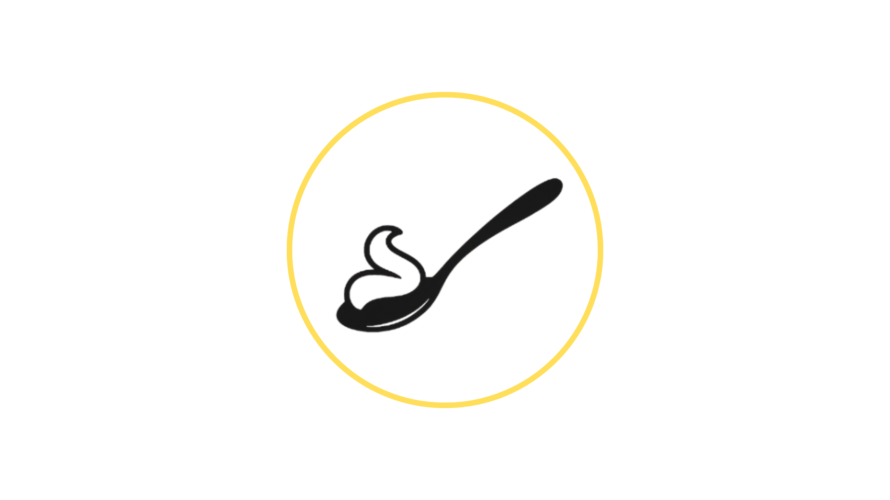

# Auténtico Repostería
## ¿Qué es Auténtico?

Auténtico es una propuesta de repostería nacida en Calarcá, Quindío, creada por mi madre Luz, repostera profesional. La página presenta una marca enfocada en postres tradicionales y opciones más saludables, elaboradas con ingredientes de calidad, dedicación y creatividad, para ofrecer sabores auténticos sin perder de vista el bienestar.

Además de contar la historia del proyecto, el sitio permite conocer el catálogo de productos, revisar las líneas de producción y hacer pedidos de forma directa por WhatsApp. Actualmente tiene cobertura en Armenia y Calarcá, con atención pensada para pedidos y celebraciones especiales.

## Tecnologías utilizadas

- HTML5: estructura principal del sitio, organización del contenido y semántica de cada sección.
- CSS3: estilos visuales, presentación general, responsive design y apariencia de la interfaz.
- JavaScript: interacción del menú móvil, control del splash de entrada y carga dinámica del catálogo.
- JSON: almacenamiento de los productos del catálogo para poder leerlos y filtrarlos desde la interfaz.

## Estructura del proyecto

- `index.html`: página principal con la historia, el inicio y la información de contacto.
- `productos.html`: sección de catálogo y líneas de producción.
- `content/productos.json`: datos de los productos mostrados en el catálogo.
- `css/styles.css`: estilos generales del sitio.
- `js/splash.js`: animación y lógica de la pantalla de carga.
- `js/main.js`: menú responsive, buscador y renderizado del catálogo.

Made with ❤️ by Mitin726
